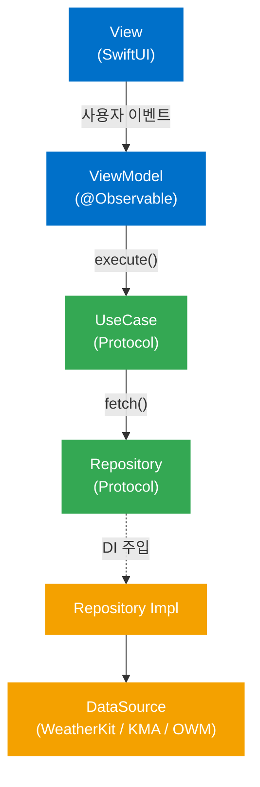
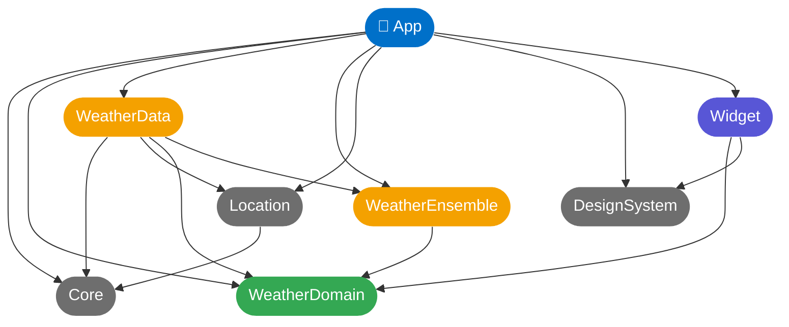

# 날씨창고 (NalssiChanggo)

> **기상청 · Apple WeatherKit · OpenWeatherMap**, 세 소스의 앙상블로 더 신뢰할 수 있는 날씨를 제공하는 iOS 날씨 앱

<p align="left">
  
  
  
  
  
</p>

---

## 목차

- [소개](#소개)
- [주요 기능](#주요-기능)
- [스크린샷](#스크린샷)
- [아키텍처](#아키텍처)
- [모듈 구조](#모듈-구조)
- [앙상블 전략](#앙상블-전략)
- [기술 스택](#기술-스택)
- [프로젝트 설정](#프로젝트-설정)
- [API 키 설정](#api-키-설정)
- [향후 계획](#향후-계획)

---

## 소개

**날씨창고**는 단일 소스에 의존하지 않고, **세 개의 독립적인 날씨 API 결과를 앙상블(가중 평균 + 가중 다수결)로 집계**하여 최종 날씨 값을 산출합니다.

한 소스가 오보를 내더라도 나머지 소스가 이를 보정하며, 소스 간 불일치 정도를 수치로 투명하게 공개합니다. 국내 기상 데이터에 특화된 **기상청 API**를 핵심 소스로 사용하고, **Apple WeatherKit**과 **OpenWeatherMap**을 보완 소스로 활용합니다.

---

## 주요 기능

### 날씨 정보
- **앙상블 현재 날씨** — 기온·체감온도·습도·풍속 가중 평균, 날씨 상태 가중 다수결
- **시간별 예보 타임라인** — 1시간 단위 기온 + 강수 확률 (색상으로 강우 위험도 시각화)
- **일별 예보** — 최저/최고 기온 + 강수 확률
- **소스 비교 시트** — 메인 카드 탭 시 소스별 기온·상태·편차 및 소스 간 일치도 확인

### 부가 기능
- **옷차림 추천** — 체감온도 + 강수 확률 기반 아이콘 조합 추천
- **대기질 카드** — 에어코리아 기반 미세먼지 등급 표시
- **홈 화면 위젯** — App Groups를 통해 앱 데이터 공유
- **새로고침 쿨다운** — 과도한 API 호출 방지 (10분)

---

## 스크린샷

> 스크린샷 추가 예정

---

## 아키텍처

**Clean Architecture + MVVM** 원칙을 따르며, 의존성 방향은 단방향으로 강제합니다.



### 설계 원칙

- **의존성 역전**: `WeatherDomain` 모듈은 외부 프레임워크에 의존하지 않는 순수 Swift 타입만 포함
- **Protocol 기반 추상화**: Repository·UseCase를 Protocol로 정의해 Mock 주입 및 단위 테스트 용이
- **단방향 의존 흐름**: 상위 모듈이 하위 모듈을 참조하며 역방향 참조 금지
- **ViewModel 단일 책임**: `@Observable`로 상태 관리, 네트워크 로직은 UseCase에 위임

---

## 모듈 구조

Tuist로 멀티 모듈 프로젝트를 관리합니다. 각 모듈은 독립적인 프레임워크 타겟으로 분리되어 있습니다.

```
NalssiChanggo/
├── Projects/
│   ├── App/                    # 진입점 · DI 조립 · View · ViewModel
│   │   ├── Sources/
│   │   │   └── Main/
│   │   │       ├── View/       # MainView, ScreenTrackingModifier
│   │   │       ├── ViewModel/  # MainViewModel (@Observable)
│   │   │       ├── Components/ # WeatherHeroCard, HourlyTimelineCard, OutfitCard ...
│   │   │       └── Model/      # WeatherDisplayData, OutfitRecommender
│   │   └── Tests/
│   ├── Core/                   # 공유 유틸 · 에러 타입 · LambertConverter
│   ├── WeatherDomain/          # Entity · Repository/UseCase Protocol (순수 Swift)
│   │   └── Sources/
│   │       ├── Entities/       # WeatherSummary, CurrentWeather, HourlyForecast ...
│   │       ├── Repositories/   # WeatherRepositoryProtocol
│   │       └── UseCases/       # FetchWeatherUseCaseProtocol
│   ├── WeatherData/            # Repository 구현 · DTO 매핑 · DataSource
│   │   └── Sources/
│   │       ├── DataSources/    # AppleWeatherDataSource, KMAWeatherDataSource, OWMDataSource
│   │       ├── Repositories/   # WeatherRepositoryImpl
│   │       └── UseCases/       # FetchWeatherUseCase
│   ├── WeatherEnsemble/        # 3소스 앙상블 집계 로직
│   │   └── Sources/
│   │       ├── EnsembleStrategy.swift   # NumericEnsembleStrategy, StateEnsembleStrategy
│   │       └── WeatherEnsembler.swift   # 가중 평균 + 가중 다수결
│   ├── Location/               # CoreLocation 래핑 · LocationManager
│   ├── DesignSystem/           # 디자인 토큰 · 아이콘 · 폰트
│   │   └── Sources/
│   │       ├── Foundation/     # Color+Token, Typography, Spacing, FontRegistrar
│   │       └── Icons/          # WeatherIcon, OutfitIcon
│   └── Widget/                 # 홈 화면 위젯 (WidgetKit)
├── Project.swift               # Tuist 프로젝트 정의
└── Tuist/
    └── Package.swift           # 외부 의존성 (Firebase)
```

### 모듈 의존 관계



---

## 앙상블 전략

`WeatherEnsemble` 모듈은 외부 프레임워크 의존성이 없는 순수 Swift로 작성되어 단위 테스트가 용이합니다.

### 전략 패턴 (Strategy Pattern)

앙상블 전략을 Protocol로 추상화하여 교체 가능하도록 설계했습니다.

```swift
// 수치 앙상블 (기온, 습도, 풍속, 강수확률)
public protocol NumericEnsembleStrategy {
    func combine(_ values: [(Double, Double)]) -> Double
}

// 상태 앙상블 (날씨 상태)
public protocol StateEnsembleStrategy {
    func combine(_ states: [(WeatherState, Double)]) -> WeatherState
}
```

### 집계 방식

| 항목 | 전략 | 가중치 (KMA : Apple : OWM) |
|------|------|--------------------------|
| 기온 / 습도 / 풍속 | 가중 평균 (`WeightedAverageStrategy`) | 0.4 : 0.3 : 0.3 |
| 강수 확률 | 가중 평균 | 0.4 : 0.3 : 0.3 |
| 날씨 상태 | 가중 다수결 (`MajorityVoteStrategy`) | 0.4 : 0.3 : 0.3 |
| 체감 온도 | Apple → KMA → OWM 우선순위 폴백 | — |

- **소스 장애 시 자동 정규화**: 일부 소스가 nil이면 정상 소스의 가중치를 합산해 재정규화
- **`.unknown` 투표 제외**: 날씨 상태 다수결 시 데이터 없음(`.unknown`) 소스는 투표에서 제외
- **소스 일치도 계산**: 표준편차 기반 0–1 점수로 세 소스 간 합의 수준을 수치화

### SourceBreakdown

메인 화면에서 탭 한 번으로 소스별 상세 데이터를 확인할 수 있습니다.

```swift
struct SourceBreakdown {
    let apple: SourceSnapshot?     // 소스별 기온, 상태, 편차
    let kma:   SourceSnapshot?
    let owm:   SourceSnapshot?
    let ensembleTemperature: Double
    let agreement: Double          // 소스 간 일치도 (0–1)
    let avgAbsDeviation: Double    // 평균 절대 편차 (°C)
}
```

---

## 기술 스택

### iOS / Apple
| 기술 | 용도 |
|------|------|
| **SwiftUI** | 전체 UI 구성 |
| **@Observable** (iOS 17) | ViewModel 상태 관리 |
| **Combine** | 네트워크 비동기 데이터 흐름 |
| **WeatherKit** | Apple 날씨 데이터 |
| **CoreLocation** | 현재 위치 획득 |
| **WidgetKit** | 홈 화면 위젯 |
| **App Groups** | 앱–위젯 데이터 공유 |

### 외부 API
| API | 제공처 | 용도 |
|-----|--------|------|
| 단기예보 / 초단기실황 | 기상청 (공공데이터포털) | 현재 날씨 · 시간별/일별 예보 |
| WeatherKit | Apple | 현재 날씨 · 예보 · 체감온도 |
| Current Weather / Forecast | OpenWeatherMap | 현재 날씨 · 5일 예보 |
| 대기질 정보 | 에어코리아 (한국환경공단) | 미세먼지 등급 |

### 빌드 / 인프라
| 도구 | 용도 |
|------|------|
| **Tuist** | 멀티 모듈 프로젝트 생성 및 의존성 관리 |
| **Firebase Analytics** | 익명 사용 통계 |
| **Firebase Crashlytics** | 크래시 리포트 |

---

## 프로젝트 설정

### 요구 사항

- Xcode 16.0+
- iOS 17.0+
- [Tuist](https://tuist.io) (`mise` 또는 `curl` 설치)
- Apple Developer 계정 (WeatherKit 활성화 필요)

### 설치

```bash
# 1. 저장소 클론
git clone https://github.com/andevv/NalssiChanggo.git
cd NalssiChanggo

# 2. Tuist 외부 패키지 설치
tuist install

# 3. Xcode 프로젝트 생성
tuist generate

# 4. Secrets.swift 생성 (아래 'API 키 설정' 참고)
# 5. Xcode에서 NalssiChanggo.xcworkspace 열기
```

> 파일이나 의존성을 추가한 이후에는 반드시 `tuist generate`를 다시 실행하세요.

---

## API 키 설정

`Projects/App/Sources/Secrets.swift` 파일을 직접 생성합니다. (`.gitignore`에 등록되어 있습니다)

```swift
enum Secrets {
    static let openWeatherMapAPIKey = "YOUR_OWM_KEY"
    static let kmaServiceKey        = "YOUR_KMA_KEY"  // URL 인코딩된 값 그대로
    static let airKoreaAPIKey       = "YOUR_AIR_KOREA_KEY"
}
```

| 키 | 발급처 |
|----|--------|
| `openWeatherMapAPIKey` | [openweathermap.org](https://openweathermap.org) (Free plan) |
| `kmaServiceKey` | [data.go.kr](https://data.go.kr) — 기상청 단기예보 서비스 신청 |
| `airKoreaAPIKey` | [data.go.kr](https://data.go.kr) — 에어코리아 대기오염정보 서비스 신청 |

> **WeatherKit**은 별도 API 키 없이 Apple Developer 계정과 Capabilities 설정으로 동작합니다.

---

## 향후 계획

- [ ] **Android 버전** — Kotlin + Jetpack Compose로 동일 앙상블 로직 포팅 예정
- [ ] 초단기예보 API (`getUltraSrtFcst`) 연동 — 운영 전환 후 SKY 정확도 개선
- [ ] iPadOS 지원
- [ ] 다크 모드 지원
- [ ] 위젯 다양화 (소형·중형·잠금 화면)
- [ ] 알림 기능 — 강수 시작 전 Push 알림

---

## 라이선스

본 프로젝트는 개인 포트폴리오 목적으로 제작되었습니다.

- 기상청 데이터: [공공데이터포털 이용약관](https://www.data.go.kr/ugs/selectPortalUseTermView.do)
- Apple WeatherKit: [WeatherKit 라이선스](https://developer.apple.com/weatherkit/data-source-attribution/)
- OpenWeatherMap: [Terms of Service](https://openweathermap.org/terms)
